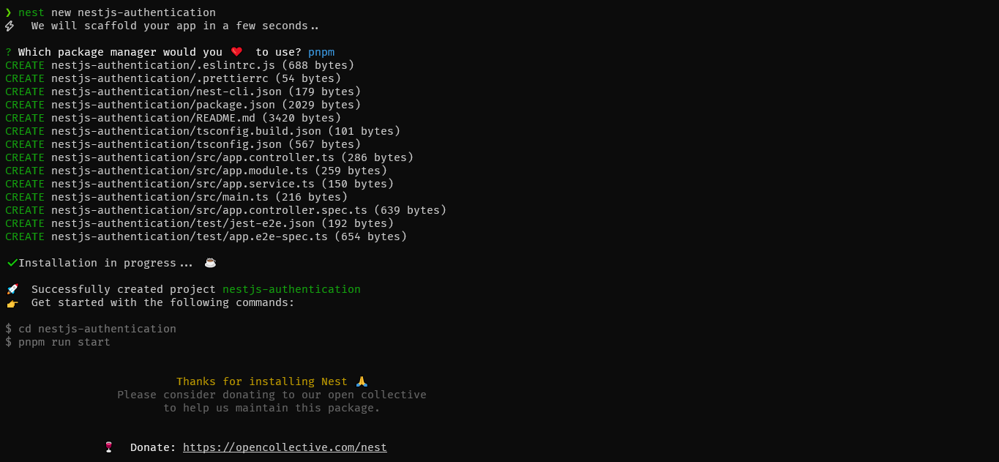

# <p align="center"> Welcome to Your NestJS Security Journey! </p>

### Introduction

<p>Building secure web applications is paramount in today's digital landscape. Therefore, at the heart of web security lies the ability to verify a user's identity <b> (authentication) </b> and ensure they possess the necessary permissions to access specific resources <b> (authorization) </b>. These two pillars work hand-in-hand to safeguard your application from unauthorized access and potential misuse. </p>

<p>This in-depth guide empowers you to implement robust authentication and authorization mechanisms within your NestJS project. </p>

### What's NestJS ?

> a progressive <a href="http://nodejs.org" target="_blank">Node.js</a> framework for building efficient, scalable, and enterprise-grade server-side applications with TypeScript / JavaScript.

Feel free to refer to the official [NestJS](https://github.com/nestjs/nest) docs for further information on the framework.

### Prerequisites

This guide assumes you have already installed:

- <a href="http://nodejs.org" target="_blank">Node.js</a> (version >= 16) on your operating system
- <a href="https://docs.nestjs.com/cli/overview" target="_blank"> NestJS CLI</a> - If you haven't already installed the NestJS CLI globally, run the following command in your OS terminal:

  ```bash
  $ pnpm install -g @nestjs/cli
  ```

### Scaffolding a new NestJS project

Use the Nest CLI to create a new project with the following commands in your OS terminal:

```bash
$ nest new < project-name >
```

Running this command will create:

- A new project directory named project-name will be created
- All the essential project dependencies will be installed. (Imagine these as building blocks for your application.)
- A core folder named `src` will be created. This folder will hold the main code files for your project.

<p align="center">
  
</p>

Change your current directory to the new project’s directory and run the app:

```bash
# change directory
$ cd nestjs-authentication

# running the app -- dev mode
$ pnpm run start
```

### Boost your development speed with SWC

> :bulb: **Tip:** For a significant boost in your development workflow, consider using [SWC](https://docs.nestjs.com/recipes/swc) as your compiler. SWC offers approximately 20x faster compilation compared to the default TypeScript compiler.

Here's how to get started with SWC:

- Install SWC packages:

  ```bash
  $ pnpm add -D @swc/cli @swc/core
  ```

- Update your `nest-cli.json` file:

  ```json
  {
    "compilerOptions": {
      "builder": "swc"
    }
  }
  ```

With these steps, SWC will be used as the default compiler for your NestJS project, accelerating your development process.

### Connecting Nest to a database

This project dives into utilizing [MySQL](https://www.mysql.com/), a widely adopted relational database management system (RDBMS), alongside [TypeORM](https://typeorm.io/), the most mature Object-Relational Mapper (ORM) for Node.js. By harnessing the power of TypeORM, we'll establish a smooth and efficient bridge between your NestJS application and your MySQL database.

Steps:

- Install Dependencies:

  ```bash
  $ pnpm add --save @nestjs/typeorm typeorm mysql2 @nestjs/config
  ```

> :memo: **Note:** <br> [@nestjs/typeorm](https://www.npmjs.com/package/@nestjs/typeorm): This is a module for NestJS that provides TypeORM integration. TypeORM is an Object-Relational Mapping (ORM) library that helps you interact with your database in an object-oriented way. <br> [typeorm](https://www.npmjs.com/package/typeorm): This is the TypeORM library itself. It provides a way to use Object-Relational Mapping (ORM) to manage your database operations in a more intuitive and flexible way. <br> [mysql2](https://www.npmjs.com/package/mysql2): This is a MySQL client for Node.js. It provides functionalities for interacting with MySQL databases. <br> [@nestjs/config](https://www.npmjs.com/package/@nestjs/config): This is a module for NestJS that provides a way to organize your configuration variables. It supports environment variables, .env files, and allows you to define configuration files in a modular way. This can be very useful for managing different configurations for different environments (like development, testing, and production) and for keeping sensitive data (like database passwords) out of your code.

- Configure TypeORM: <br> Once the installation process is complete, we can import the TypeOrmModule into the root AppModule.

  - Create <b>.env</b> File:

    - Create a file named `.env` in your project root directory (not tracked by version control).
    - Define environment variables for your database connection details, e.g.:

      ```bash
      DB_HOST=your_mysql_host
      DB_PORT=your_mysql_port
      DB_USERNAME=your_mysql_username
      DB_PASSWORD=your_mysql_password
      DB_DATABASE=your_mysql_database
      ```

  - Create a configuration file for TypeORM

    - Create a file named `config/database.config.ts` in your root directory
    - Creating a configuration code for connecting to a MySQL database using TypeORM

      ```bash
              import { registerAs } from '@nestjs/config';

              export default registerAs('database', () => ({
                type: 'mysql',
                host: process.env.DB_HOST || 'localhost',
                port: parseInt(process.env.DB_PORT, 10) || 3306,
                username: process.env.DB_USERNAME,
                password: process.env.DB_PASSWORD,
                database: process.env.DB_DATABASE,
                entities: [`${__dirname}/../**/*.entity{.ts,.js}`],
                synchronize: process.env.NODE_ENV === 'development',
              }));
      ```

  - Create a file named `config/index.ts` and put this code:

    ```bash
    export { default as databaseConfig } from './database.config';
    ```

  - Import and Configure the **TypeOrmModule** into the root **AppModule**

    ```bash
    TypeOrmModule.forRootAsync({
        useFactory: (configService: ConfigService) => ({
          ...configService.get('database'),
        }),
        inject: [ConfigService],
      }),
    ```

    This above code is telling NestJS to create a database connection using TypeORM. The connection options are retrieved asynchronously from your application’s ‘database’ configuration using the **ConfigService**.

  - In **AppModule**, import and configure **ConfigModule**

    ```bash
        ConfigModule.forRoot({
        load: [databaseConfig],
        }),
    ```

  - Docker container

  This project leverages Docker containers for a streamlined approach to managing your MySQL database.

  - Create a file named `docker-compose.yml` in the project root directory and put this code:

    ```yaml
    version: '3'
    services:
      db:
        container_name: 'auth_container'
        image: mysql:8
        restart: always
        env_file:
          - .env
        ports:
          - '3306:3306'
        volumes:
          - db_data:/var/lib/mysql

    volumes:
      db_data: {}
    ```

  - Running the Database with Docker Compose:

    - **Prerequisites**: Ensure you have Docker installed on your system. You can download it from [docker](https://www.docker.com/).
    - Add the following lines to your `.env` file, replacing `<your_mysql_password>` and `<your_mysql_database>` with actual values:

      ```bash
        MYSQL_ROOT_PASSWORD=<your_mysql_password>
        MYSQL_DATABASE=<your_mysql_database>
      ```

    - **Build and Run with Docker Compose**:
      - Open a terminal and navigate to root project directory
      - Run the following command to build and start the database container:
      ```bash
      docker-compose up -d
      ```

### Stay in touch

- Author - [Michael D Asfaw](https://mike-bits.dev)
- Youtube - [Mike Bits](http://www.youtube.com/@mike-bits)
